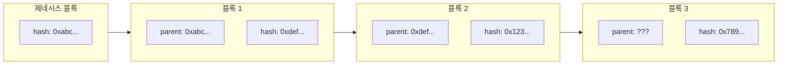
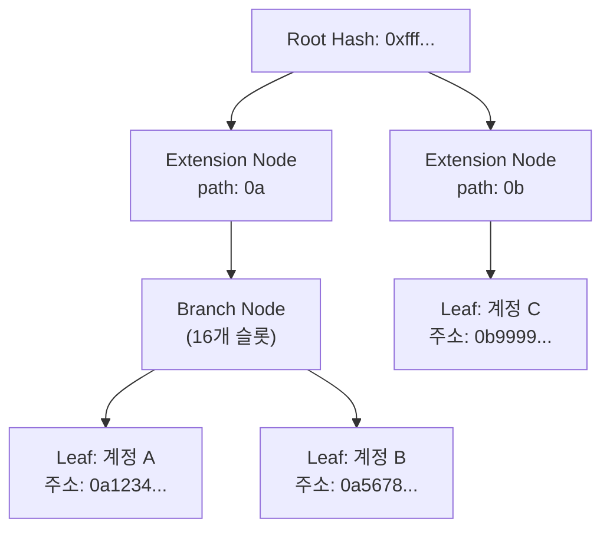

# Week 4 Quiz: Network/Block + wagmi

> **제출 방법:** 이 파일을 복사하여 답변을 작성한 후, PR로 제출하세요.
> **평가 기준:** 개념 이해도 중심 - 문법 오류보다 논리적 설명을 중시합니다.

---

## 문제 1: 블록 헤더 필드 (객관식)

다음 상황을 고려하세요:

```
블록 100의 해시: 0xabc123...
블록 101의 해시: 0xdef456...
```

블록 101의 `parentHash` 필드에는 어떤 값이 저장되어 있나요? 그리고 **왜** 이런 방식으로 연결하나요?

**보기:**
A) 0xdef456... - 자기 자신의 해시를 저장하여 무결성을 보장한다
B) 0xabc123... - 이전 블록의 해시를 저장하여 체인 연결과 불변성을 보장한다
C) 블록 번호 100 - 숫자로 순서를 추적한다
D) 빈 값 - 헤더에는 해시가 저장되지 않는다

**답변:**
<!--
정답 알파벳과 왜 이 답을 선택했는지 설명하세요.
다른 보기가 왜 틀린지도 간략히 설명해 주세요.
-->
B) 이전 블록 헤더의 해시를 저장하여 직전 블록과 연결된 체인 구조를 형성한다. 이 구조에 의해 하나의 블록 내용이 변경되면 그 블록의 해시가 바뀌고 이후 모든 블록의 해시도 연쇄적으로 변경되므로 블록의 조작 여부를 바로 감지할 수 있고 체인의 불변성을 보장한다.

자기 자신의 블록 헤더 해시를 계산하여 저장하기 위해선 먼저 헤더에 존재하는 모든 필드가 이미 결정되어야하므로 자기참조 문제가 발생한다. 이에 논리적으로 불가능하고 parentHash필드를 제외한 값들로 자신의 해시를 저장한다 가정하더라도 블록들이 서로 체인으로 연결되지 않아 이후 블록과의 무결성이 보장되지 않는다.

블록번호로 순서를 추적하더라도 포크 상황에서 같은 블록 번호를 가진 다수의 블록이 존재할 수 있고 이에 무결성과 불변성이 보장된 하나의 체인을 유일하게 보장하지 못한다.

헤더에 해시를 저장하지 않는다면 기존 블록과 연결되는 체인 구조를 형성할 수 없어 무결성, 불변성 등을 보장하지 못한다.

---

## 문제 2: MPT 목적 (객관식)

이더리움에서 Merkle Patricia Trie(MPT)를 사용하는 **가장 중요한 이유**는 무엇인가요?

**보기:**
A) 데이터를 암호화하여 외부에서 읽을 수 없게 한다
B) 트랜잭션 처리 속도를 10배 이상 높인다
C) 전체 데이터 없이도 특정 데이터의 존재와 정확성을 효율적으로 증명한다
D) 블록 크기를 줄여서 저장 공간을 절약한다

**답변:**
<!--
정답 알파벳과 왜 이 기능이 중요한지 설명하세요.
Light Node와 연결지어 설명하면 더 좋습니다.
-->
C) MPT를 사용하면 블록 헤더만 가지고도 상태 변경의 정확성을 검증할 수 있기 때문이다. 라이트 노드는 전체 상태를 저장하지 않고 블록 헤더만 보관하며 상태 데이터가 필요할 때마다 풀노드에 요청하여 받는다. 이떄 데이터와 Merkle Proof(MPT에서 해당 노드 ~ 루트의 해시 경로)를 함께 받으면 라이트 노드는 자신이 갖고있는 루트 해시와 비교하여 위조 여부를 스스로 검증할 수 있다. 따라서 MPT는 라이트 노드가 풀노드에 대한 신뢰를 전제하지 않고 스스로 체인의 상태 무결성을 검증할 수 있게 하는 안전 장치이다.

---

## 문제 3: 체인 연결과 보안 (객관식)

공격자가 블록 50의 트랜잭션을 수정하려고 합니다. 현재 체인의 최신 블록은 100입니다. 이 공격이 **왜** 어려운가요?

**보기:**
A) 블록 50은 너무 오래되어서 시스템에서 접근할 수 없다
B) 블록 50을 수정하면 해시가 바뀌고, 블록 51부터 100까지 모든 블록의 parentHash가 불일치하게 된다
C) 블록 50은 이미 암호화되어 있어서 복호화 키가 필요하다
D) 네트워크 관리자만 과거 블록을 수정할 수 있다

**답변:**
<!--
정답 알파벳과 블록체인의 불변성이 어떻게 작동하는지 설명하세요.
-->
B) 블록체인 시스템은 이전 블록 헤더의 해시값을 다음 블록의 parentHash가 참조하는 구조로 체인을 형성한다. 블록 50이 변경되어 해시값이 바뀌게 됐을 경우, 블록 0~50의 체인과 블록 51~100과의 체인이 끊어지게 된다. 이를 무결한 체인으로 바로잡기 위해서는 블록 51의 parentHash를 올바른 값으로 수정해야하고, 이로 인해 블록 52와의 연결이 끊어진다. 이렇게 수정에 의한 불일치는 블록 100까지 연쇄적으로 연결되므로 블록 50개를 수정하고 그 동안 새로 채굴된 블록까지 추월해서 체인을 연결하는 것은 사실상 불가능하다.

---

## 문제 4: MPT 진화 과정 (단답형)

MPT(Merkle Patricia Trie)는 세 가지 자료구조의 장점을 결합한 것입니다:
1. **Trie** -> 2. **Patricia Trie** -> 3. **Merkle Patricia Trie**

**왜** 각 단계의 발전이 필요했나요? 각 단계가 해결하는 문제를 간단히 설명하세요.

**답변:**
<!--
1. Trie가 해결하는 문제:

2. Patricia Trie가 해결하는 문제 (Trie의 한계):

3. Merkle Patricia Trie가 해결하는 문제 (Patricia Trie의 한계):

-->

Trie 구조는 키를 문자열로 분해하여 각 글자를 따라 내려가는 트리 구조이다. prefix기반 탐색을 제공하여 키 길이 N에 대해 O(N)의 조회를 보장하며 키-값 데이터의 저장 및 조회를 효율적으로 할 수 있게 한다.

그러나 경로가 한 방향으로만 이어져도 중간 노드가 계속 생기는 특성으로 인해 트리의 깊이가 불필요하게 증가하고 메모리 낭비가 심하다는 한계가 존재한다. 이에 Patricia Trie 구조는 단일 자식 노드를 갖는 prefix의 서브트리를 하나의 노드로 압축하여 트리의 깊이(조회 복잡도)와 노드 수(저장 공간)를 최적화했다.

Patricia Trie 구조는 데이터의 변경 여부를 감지하고 무결성을 보장하지 못한다는 보안 상의 한계가 존재한다. 따라서 MPT는 각 노드에 해시값을 포함하여 하위 노드의 변경이 루트 해시에 반영되도록 한다. 이로 인해 루트 해시 하나로 전체 상태를 요약할 수 있으므로 라이트 노드가 전체 상태를 저장하지 않고 Merkle Proof만으로 상태의 무결성을 신뢰없이 간단하게 검증할 수 있게 함으로써 보안성을 확보하였다.


---

## 문제 5: Eclipse Attack 방어 (단답형)

Eclipse Attack은 공격자가 피해자 노드의 **모든 피어 연결**을 자신이 통제하는 노드로 바꾸는 공격입니다.

1) 이 공격이 성공하면 피해자에게 **어떤 피해**가 발생할 수 있나요?
2) 개인 노드 운영자가 이 공격을 **방어**하기 위해 할 수 있는 행동은 무엇인가요?

**답변:**
<!--
1) 가능한 피해 (2가지 이상):


2) 방어 방법 (2가지 이상):

-->

Eclipse Attack의 피해자는 공격자가 통제하는 가짜 네트워크에 갇혀 전체 네트워크의 상태로부터 고립된다. 이 상황에서 공격자는 잘못된 블록, 트랜잭션 정보를 전달하거나 특정 블록, 트랜잭션을 전달하지 않는 방식으로 피해자가 최신 체인 상태와 동기화하지 못하게 할 수 있다. 이는 피해자가 잘못된 행동을 하도록 유도하여 슬래싱을 당하게 하거나, 채굴 보상 기회를 박탈함으로써 경제적 손실을 줄 수 있다.

또한 가짜 네트워크에 속한 피해자에게 잘못된 트랜잭션을 전달하고 실제 네트워크에는 이와 다른 트랜잭션을 전파할 수 있다. 이로 인해 피해자가 실제 체인에서 무효한 트랜잭션을 유효하다고 믿고 후속 거래를 하도록 유도하는 결제 사기를 칠 수 있다.

Eclipse Attack을 방어하기 위해 다양한 IP 대역과 연결하여 피어 다양성을 확보하는 방법이 있다. 지리적으로 인접한 AS 내에서 피어를 연결하기보다 지리적으로 분산된 다른 서브넷에 속한  노드와 피어를 맺으면 공격자가 장악할 수 있는 네트워크 범위에서 벗어날 수 있다.

또한 주기적으로 피어를 교체하여 장기적인 고립을 방지할 수 있다. 비정상적 블록 지연을 감지하는 즉시 다른 노드와 피어 연결을 함으로써 공격자가 모든 연결을 완전히 장악하기 전에 벗어날 수 있고 이미 고립되었더라도 더 심각한 불일치가 발생하기 전에 탈출할 수 있다.

---

## 문제 6: 노드 종류 선택 (단답형)

친구가 이더리움 개발을 시작하려고 합니다. 다음 세 가지 상황에서 각각 어떤 노드 타입(Full, Light, Archive)을 추천하시겠습니까? **왜** 그 노드를 추천하는지도 설명하세요.

1) 모바일 지갑 앱 개발
2) 블록체인 데이터 분석 서비스 개발
3) 일반적인 dApp 백엔드 개발

**답변:**

1) 모바일 지갑 앱: 
   추천 노드: Light Node
   이유: 저장 공간, 네트워크 IO, 배터리 제한 등 하드웨어적 특성으로 인해 최소 자원으로도 신뢰 없이 검증 가능한 라이트 노드 환경이 적합하다.

2) 블록체인 데이터 분석:
   추천 노드: Archive Node
   이유: 과거 특정 시점의 상태를 조회 및 추적하고, 과거 스마트컨트랙트 상태를 분석하기 위해선 과거의 데이터를 전부 저장하는 아카이브 노드 환경이 적합하다.

3) dApp 백엔드:
   추천 노드: 
   이유: 일반적인 dApp 백엔드는 현재 상태를 기준으로 스마트 컨트랙트에 트랜잭션을 전송하고 최신 상태 값을 조회하는 기능이 중심이 된다. 풀 노드는 제네시스부터 모든 블록과 트랜잭션을 검증하고 저장하며 최신 상태의 정합성을 보장한다. 대부분의 dApp 서비스는 과거 특정 시점의 상태까지 조회할 필요가 없기 때문에 모든 과거 상태를 저장하는 아카이브 노드보다 블록이 진행될 때마다 상태를 업데이트하고 이전 상태는 제거하는 풀 노드가 저장 공간 측면에서 효율적이다. 

---

## 문제 7: useAccount Hook (빈칸 채우기)

다음 코드의 빈칸을 채워서 지갑 연결 상태를 표시하는 컴포넌트를 완성하세요:

```typescript
import { useAccount } from 'wagmi';

function WalletStatus() {
  // TODO: useAccount hook에서 필요한 값들을 가져오세요
  const { address, isConnected } = useAccount();

  if (!isConnected) {
    return <div>지갑이 연결되지 않았습니다</div>;
  }

  return (
    <div>
      <p>연결된 주소: {address}</p>
    </div>
  );
}
```

**답변:**
```typescript
// 완성된 코드를 여기에 작성하세요

```

**왜 이렇게 작성했나요:**
<!--
useAccount hook이 제공하는 값들과 각각의 역할을 설명하세요.
-->

useAccount()는 지갑 상태를 관리하는 wagmi의 hook으로 지갑 연결 상태를 구독하여 React 컴포넌트에서 사용할 수 있게 해준다. address는 현재 연결된 지갑 주소, isConnected는 지갑 연결 여부를 의미한다. React는 원래 클래스 컴포넌트에서만 상태 저장, 변경 감지, 자동 렌더링과 같은 생명주기 관리 기능을 제공했지만, Hook 도입 이후 함수형 컴포넌트에서도 이러한 기능을 사용할 수 있게 되었다.

useAccount는 내부적으로 지갑 상태를 구독하고 상태가 변경되면 React의 상태 시스템에 변경을 알린다. React는 이를 감지하여 해당 컴포넌트를 다시 렌더링하며, isConnected 값에 따라 화면에 표시되는 UI를 다르게 설계할 수 있도록 지원한다.

---

## 문제 8: useReadContract Hook (빈칸 채우기)

다음 코드의 빈칸을 채워서 컨트랙트의 `getCount` 함수 결과를 화면에 표시하세요:

```typescript
import { useReadContract } from 'wagmi';

const counterABI = [
  {
    name: 'getCount',
    type: 'function',
    stateMutability: 'view',
    inputs: [],
    outputs: [{ name: 'count', type: 'uint256' }],
  },
] as const;

function CountDisplay() {
  const { data, isLoading, error } = useReadContract({
    // TODO: 필요한 설정을 채우세요
    address: '0x1234...5678',
    abi: counterABI,
    functionName: 'getCount',
  });

  if (isLoading) return <div>로딩 중...</div>;
  if (error) return <div>에러 발생</div>;

  return <div>현재 카운트: {data?.toString() ?? '0'}</div>;     //uint256은 wagmi에서 bigint로 반환되므로 toString으로 변환
}
```

**답변:**
```typescript
// 완성된 코드를 여기에 작성하세요

```

**왜 이렇게 작성했나요:**
<!--
useReadContract의 필수 설정 항목과 data를 화면에 표시할 때 주의할 점을 설명하세요.
-->
useReadContract는 스마트 컨트랙트의 데이터를 읽기 위한 hook으로 해당 컨트랙트에서 조회하고자 하는 함수나 변수의 getter 인터페이스를 ABI로 정의해야 한다. 외부인인 우리는 컨트랙트의 바이트코드만 보고 그 구조를 직접 이해할 수 없다. 따라서 이들을 조회하기 위해 컴파일러가 자동으로 생성하는 getter 함수의 인터페이스를 명시함으로써 우리는 이를 기반으로 함수 호출 데이터를 자동으로 인코딩하고 반환값을 디코딩하여 안전하게 데이터를 조회할 수 있다.

추가로 useReadContract는 RPC 호출로 값을 가져오는 구조이므로 비동기적으로 실행되고 이로 인해 초기 렌더링시 바로 값이 준비되지 않을 수 있다. 따라서 바로 렌더링하기보다 if (isLoading) ..., if (error) ... 구조로 예외 처리를 하는 것이 안전하다. 또한 Solidity의 uint256은 wagmi에서 bigint로 반환되는데 React는 이 타입을 직접 렌더링할 수 없다. 따라서 문자열로 반환 후 화면에 출력해야 한다.

---

## 문제 9: useWriteContract 버그 (취약점 찾기)

다음 코드에서 **문제점**을 찾고 수정하세요:

```typescript
// BAD CODE - 문제점 찾기
import { useWriteContract } from 'wagmi';

function IncrementButton() {
  const { writeContract, isPending } = useWriteContract();

  const handleClick = () => {
    // 문제가 있는 코드
    writeContract({
      address: '0x1234...5678',
      functionName: 'increment',
      // abi가 없음! -> abi 전달하도록 수정
      abi: contractABI
    });
  };

  return (
    <button onClick={handleClick} disabled={isPending}>
      증가하기
    </button>
  );
}
```

**1) 발견한 문제점:**
<!--
무엇이 빠졌거나 잘못되었는지 설명하세요.
-->
writeContract 함수 실행 시 wagmi는 내부적으로 viem을 사용하여 함수 호출에 대한 트랜잭션을 생성하는데 이때 인자로 받은 ABI를 기반으로 다음과 같은 과정이 수행된다.

1️⃣ ABI에서 인자로 전달받은 increment 함수 찾기
2️⃣ increment() 시그니처 생성
3️⃣ keccak256("increment()") 계산
4️⃣ 앞 4바이트 → function selector
5️⃣ args를 ABI 타입에 맞게 인코딩
6️⃣ selector + encoded args → calldata 생성
7️⃣ 그 calldata로 트랜잭션 전송

그러나 위 코드처럼 컨트랙트의 ABI를 인자로 전달하지 않으면 이러한 과정을 수행할 수 없다.

**2) 왜 이것이 문제인가:**
<!--
이 문제가 어떤 오류나 동작 이상을 일으키는지 설명하세요.
-->

ABI가 전달되지 않으면 wagmi는 함수 시그니처와 파라미터 타입을 알 수 없어 selector 및 calldata를 자동 생성할 수 없다. 따라서 writeContract 호출 시 에러가 발생하며 wagmi가 제공하는 자동 인코딩 대신 개발자가 트랜잭션 데이터를 수동으로 인코딩하고 저수준으로 함수를 호출해야한다.

**3) 올바른 수정 방법:**
```typescript
// GOOD CODE - 수정된 버전을 작성하세요

```

---

## 문제 10: 블록 연결 구조 (다이어그램 해석)

다음 다이어그램은 블록체인의 연결 구조를 보여줍니다:



**질문:**

1) 블록 3의 `parent: ???` 에 들어갈 값은 무엇인가요?

0x123...

2) 만약 블록 1의 내용이 수정되면, 블록 2와 블록 3에 **어떤 영향**이 있나요? 왜 그런가요?

블록 1의 내용이 수정되면 블록 1의 hash 값이 변경된다. 이에 따라 블록 2의 기존 parent 값과 불일치하게 되며 B1 전후로 체인이 끊기게 된다. 만약 이를 반영하여 블록 2의 parent 필드를 수정하면 블록 2의 hash 값 또한 변경된다. 이는 또 다시 블록 3의 parent 값과의 불일치를 야기하는 방식으로 연쇄적으로 불일치가 전파된다.

3) 제네시스 블록(블록 0)의 parentHash는 어떤 특별한 값을 가지나요? 왜 그런가요?

제네시스 블록은 체인의 첫번째 블록으로 참조하는 이전 블록이 없다. 따라서 어떤 블록의 해시값도 아니라는 의미의 0x000...00이 들어간다. 

---

## 문제 11: MPT 트리 구조 (다이어그램 해석)

다음 다이어그램은 MPT의 노드 구조를 보여줍니다:



**질문:**

1) 계정 A와 계정 B가 같은 Branch Node 아래에 있는 이유는 무엇인가요? (주소 패턴을 힌트로 사용하세요)

A와 B는 0a를 공통 prefix로 갖고 있으므로 0a 경로를 압축하는 EXT1을 부모 노드로 하게 된다.

2) Extension Node가 하는 역할은 무엇인가요? 없다면 어떤 문제가 생기나요?

Extension Node는 공통 경로(prefix)를 압축하기 위한 노드로 트리 깊이와 노드 수를 줄이고, 탐색 및 해시 계산 비용을 감소시킨다. 이 노드가 없다면 공통 prefix가 있음에도 매 단계 불필요한 중간 노드가 생성되어 트리의 깊이가 과도하게 깊어지고 이에 따라 저장 공간 낭비와 탐색 경로가 증가하는 문제가 발생한다. 

3) Root Hash만 알면 어떻게 특정 계정의 데이터 존재를 **증명**할 수 있나요? (Light Client 관점에서)

Light client가 개별적으로 저장하는 블록 헤더는 world state를 담은 MPT의 Root Hash를 담고있다.(stateRoot)
Light client는 특정 데이터를 검증하기 위해 다음과 같은 과정을 거친다.
1. 풀 노드에게 특정 계정과 그 계정부터 루트까지 경로 노드 정보(Merkle Proof) 요청
2. 풀 노드로부터 경로에 전달받은 노드 정보를 이용해 직접 Root Hash 재계산
3. 최종적으로 계산한 Root Hash 값이 저장하고 있는 stateRoot와 일치하는지 검증

일치하면 특정 계정의 데이터의 존재와 그 값의 무결성이 보장된다. 
---

## 제출 전 체크리스트

- [x] 모든 문제에 답변을 작성했는가?
- [x] 객관식 문제: 정답 선택 **이유**를 설명했는가?
- [x] 단답형 문제: 2-3문장 이상으로 충분히 설명했는가?
- [x] 코드 문제: 완성된 코드와 **왜 그렇게 작성했는지** 설명했는가?
- [x] 다이어그램 문제: 각 질문에 논리적으로 답변했는가?
