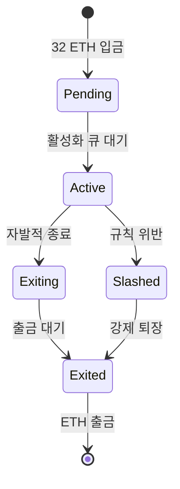
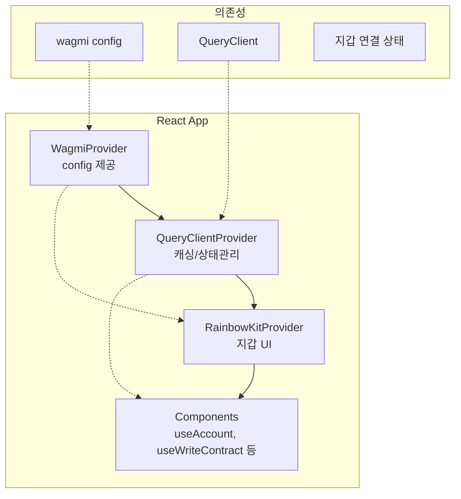

# Week 5 Quiz: PoS/Consensus + RainbowKit

> **제출 방법:** 이 파일을 복사하여 답변을 작성한 후, PR로 제출하세요.
> **평가 기준:** 개념 이해도 중심 - 문법 오류보다 논리적 설명을 중시합니다.

---

## 문제 1: PoS 개념 (객관식)

이더리움이 PoW(작업 증명)에서 PoS(지분 증명)로 전환한 **가장 주요한 이유**는 무엇인가요?

**보기:**
A) 트랜잭션 처리 속도를 10배 이상 높이기 위해
B) 에너지 소비를 99.95% 이상 줄이고 환경 친화적으로 만들기 위해
C) 블록 크기를 늘려서 더 많은 데이터를 저장하기 위해
D) 채굴 장비 없이도 누구나 블록을 생성할 수 있게 하기 위해

**답변:**
<!--
정답 알파벳과 왜 이 답을 선택했는지 설명하세요.
PoW의 문제점과 PoS의 해결책을 연결지어 설명하면 더 좋습니다.
-->
B) PoW는 대량의 연산과 전력을 소비하는 작업을 통해 채굴을 증명하는 구조라서 에너지 비용이 매우 컸다. PoS는 계산 경쟁 대신 스테이킹된 ETH와 검증자 규칙을 기반으로 합의를 만들기 때문에 보안을 유지하면서 에너지 소비를 크게 줄일 수 있다.

---

## 문제 2: 검증자 역할 (객관식)

이더리움 PoS에서 검증자(Validator)가 수행하는 **두 가지 주요 역할**은 무엇인가요?

**보기:**
A) 블록 채굴(Mining)과 가스 가격 결정
B) 블록 제안(Proposing)과 블록 증명(Attesting)
C) 트랜잭션 전송과 수수료 수집
D) 스마트 컨트랙트 배포와 실행

**답변:**
<!--
정답 알파벳과 각 역할이 무엇을 의미하는지 설명하세요.
-->
B) 블록 제안은 랜덤으로 선택된 하나의 검증자가 새 블록을 생성하여 네트워크에 제안하는 역할이다. 블록 증명은 다른 검증자들이 제안된 블록이 유효한지 확인하고 투표함으로써 블록의 정당성을 확보하고 canonical한 체인을 유일하게 결정한다.

## 문제 3: 왜 PoW에서 PoS로? (단답형)

PoW(작업 증명)와 PoS(지분 증명)의 **핵심 차이점**은 무엇인가요?
"자격 증명 방식"과 "보안 보장 방식" 두 관점에서 각각 비교하세요.

**답변:**

자격 증명 방식:
  - PoW: 컴퓨팅 자원과 전기 비용을 투입해서 조건을 만족하는 해시값을 갖는 블록을 먼저 만드는 채굴자가 채굴 보상을 획득.
  - PoS: 일정량의 ETH를 예치한 검증자가 지분에 비례한 확률로 블록을 제안하고 다른 검증자들이 attestation을 통해 블록의 유효성을 검증

보안 보장 방식:
  - PoW: 채굴에 대해 막대한 연산 자원과 전력을 계속 투입해야 하므로 공격 시도의 경제적 비용을 높인다.
  - PoS: 잘못된 행위에 대해 스테이킹된 ETH가 슬래싱될 수 있으므로 담보를 빼앗는 경제적 응징으로 방지한다.
---

## 문제 4: 슬래싱의 목적 (단답형)

슬래싱(Slashing)은 검증자의 스테이킹된 ETH를 **강제로 소각**하는 패널티입니다.

1) 슬래싱이 발동되는 **두 가지 조건**은 무엇인가요?
2) **왜** 이런 처벌이 필요한가요? 없다면 어떤 문제가 생길 수 있나요?

**답변:**

1) 슬래싱 조건 (2가지):
     - Double vote: 같은 에폭에 대해 서로 충돌하는 체인에 대해 투표(attestation)하는 경우      
     (투표에는 source checkpoint,target checkpoint, beacon_block_root 세 필드 존재)
     (체크포인트 투표만 문제없다면 head 블록 투표가 이상해도 슬래싱을 당하지 않음)
     - Surround vote: 이미 제출한 투표의 체크포인트 범위(source-target)를 감싸는 체인으로 투표하는 경우

2) 슬래싱이 필요한 이유:
  검증자는 자신이 투표한 블록/체크포인트가 올바른 체인으로 결정되면 보상을 얻을 수 있다. 만약 슬래싱이 없다면 검증자들은 포크 상황에서 어떤 체인이 최종적으로 결정되더라도 보상을 얻기 위해 아무런 제약없이 여러 포크에 동시에 투표할 수 있다. 이로 인해 서로 상충하는 체인이 동시에 2/3의 합의를 얻어 finalizaed될 수 있으며 체인이 유일하게 확정되지 않게 되어 네트워크가 혼란스러워질 수 있다.


---

## 문제 5: 체인 선택 규칙 (단답형)

여러 유효한 블록이 동시에 제안되면 **포크(Fork)**가 발생합니다.
이더리움의 LMD-GHOST(Latest Message Driven GHOST) 규칙은 어떻게 "정규 체인"을 선택하나요?

1) LMD-GHOST의 기본 원리는 무엇인가요?
2) **왜** "가장 최근 메시지"를 사용하나요? (오래된 메시지를 사용하면 어떤 문제가?)

**답변:**

1) LMD-GHOST 원리:
  검증자들의 최신 투표(attestation)가 가장 많이 모인 방향으로 트리를 따라가며 헤드를 선택하는 방식으로 가장 최근의 검증자가 많이 지지한 브랜치를 canonical 체인으로 선택한다.


2) 최근 메시지 사용 이유:
  오래된 메시지를 누적해서 보게되면 마음을 바꿔 새 체인에 투표한 검증자의 현재 표와 상충되는 과거 표가 현재 선택에 잘못 반영될 수 있다.
  최신 메시지를 기준으로 합산해야 포크 상황에서 검증자들이 현재 제일 지지하는 체인을 반영할 수 있다.

---

## 문제 6: RainbowKit Provider 계층 (빈칸 채우기)

다음 코드의 빈칸을 채워서 RainbowKit을 올바르게 설정하세요.
**Provider 순서가 중요합니다!**

```typescript
'use client';

// TODO: 필요한 스타일 import
_________________________________________

import { RainbowKitProvider } from '@rainbow-me/rainbowkit';
import { WagmiProvider } from 'wagmi';
import { QueryClientProvider, QueryClient } from '@tanstack/react-query';
import { config } from '@/config/wagmi';

const queryClient = new QueryClient();

export default function RootLayout({ children }) {
  return (
    <html lang="ko">
      <body>
        {/* TODO: Provider를 올바른 순서로 중첩하세요 */}
        <_________________ config={config}>
          <_________________ client={queryClient}>
            <_________________>
              {children}
            </_________________>
          </_________________>
        </_________________>
      </body>
    </html>
  );
}
```

**답변:**
```typescript
// 완성된 코드를 여기에 작성하세요
'use client';

  import '@rainbow-me/rainbowkit/styles.css';

  import { RainbowKitProvider } from '@rainbow-me/rainbowkit';
  import { WagmiProvider } from 'wagmi';
  import { QueryClientProvider, QueryClient } from '@tanstack/react-query';
  import { config } from '@/config/wagmi';

  const queryClient = new QueryClient();

  export default function RootLayout({ children }) {
    return (
      <html lang="ko">
        <body>
          <WagmiProvider config={config}>
            <QueryClientProvider client={queryClient}>
              <RainbowKitProvider>
                {children}
              </RainbowKitProvider>
            </QueryClientProvider>
          </WagmiProvider>
        </body>
      </html>
    );
  }

```

**왜 이 순서인가요:**

WagmiProvider는 가장 바깥에서 wagmi의 context와 config를 제공하며, 그 내부의 wagmi 훅과 RainbowKitProvider가 지갑 연결과 관련된 상태를 사용할 수 있도록 한다.
QueryClientProvider는 TanStack Query의 캐시와 데이터 관리를 제공하여 RainbowKit와 wagmi 훅이 RPC 요청 결과를 효율적으로 처리할 수 있도록 한다.
RainbowKitProvider는 이러한 context 위에서 지갑 연결 UI를 구성한다.

따라서 Provider의 순서가 올바르게 설정되지 않으면 Cannot find WagmiContext와 같은 오류가 발생하거나 query client를 찾지 못해 지갑 연결 및 데이터 요청이 정상적으로 동작하지 않을 수 있다.

---

## 문제 7: Provider 순서 버그 (취약점 찾기)

다음 코드에서 **문제점**을 찾고 수정하세요:

```typescript
// BAD CODE - 문제점 찾기
'use client';

import '@rainbow-me/rainbowkit/styles.css';
import { RainbowKitProvider } from '@rainbow-me/rainbowkit';
import { WagmiProvider } from 'wagmi';
import { QueryClientProvider, QueryClient } from '@tanstack/react-query';
import { config } from '@/config/wagmi';

const queryClient = new QueryClient();

export default function Providers({ children }) {
  return (
    // 문제가 있는 Provider 순서!
    <QueryClientProvider client={queryClient}>
      <RainbowKitProvider>
        <WagmiProvider config={config}>
          {children}
        </WagmiProvider>
      </RainbowKitProvider>
    </QueryClientProvider>
  );
}
```

**1) 발견한 문제점:**
<!--
무엇이 잘못되었는지 설명하세요.
-->
Provider 순서가 잘못되었다. WagmiProvider 바깥에 위치한 RainbowKitProvider와 내부 컴포넌트는 동작을 위해 필요한 wagmi context를 받지 못하게 된다.


**2) 왜 이것이 문제인가:**
<!--
이 순서로 인해 어떤 오류가 발생하는지 설명하세요.
-->
useAccount, useWriteContract 같은 wagmi 훅은 상위에 WagmiProvider가 있어야 동작할 수 있다. 그런데 현재 구조에서는 RainbowKitProvider와 그 내부 컴포넌트가 먼저 렌더링되기 때문에 `Cannot find WagmiContext` 오류가 날 수 있다.

**3) 올바른 수정 방법:**
```typescript
// GOOD CODE - 수정된 버전을 작성하세요
'use client';

import '@rainbow-me/rainbowkit/styles.css';
import { RainbowKitProvider } from '@rainbow-me/rainbowkit';
import { WagmiProvider } from 'wagmi';
import { QueryClientProvider, QueryClient } from '@tanstack/react-query';
import { config } from '@/config/wagmi';

const queryClient = new QueryClient();

export default function Providers({ children }) {
  return (
    <WagmiProvider config={config}>
      <QueryClientProvider client={queryClient}>
        <RainbowKitProvider>
          {children}
        </RainbowKitProvider>
      </QueryClientProvider>
    </WagmiProvider>
  );
}

```

---

## 문제 8: 트랜잭션 상태 처리 (빈칸 채우기)

다음 코드의 빈칸을 채워서 트랜잭션 전송 후 **확인 상태를 추적**하세요:

```typescript
'use client';

import { useWriteContract, useWaitForTransactionReceipt } from 'wagmi';

const abi = [
  {
    name: 'increment',
    type: 'function',
    stateMutability: 'nonpayable',
    inputs: [],
    outputs: [],
  },
] as const;

function IncrementButton() {
  const { writeContract, data: hash, isPending } = useWriteContract();

  // TODO: 트랜잭션 확인 상태를 추적하는 hook
  const { isLoading: isConfirming, isSuccess } = useWaitForTransactionReceipt({
    hash,
  });

  return (
    <div>
      <button
        onClick={() =>
          writeContract({
            address: '0x1234...5678',
            abi,
            functionName: 'increment',
          })
        }
        disabled={isPending || isConfirming}
      >
        {isPending ? '서명 대기 중...' : isConfirming ? '확인 중...' : '증가'}
      </button>

      {isSuccess && <p>트랜잭션 성공!</p>}
    </div>
  );
}
```

**답변:**
```typescript
// 완성된 코드를 여기에 작성하세요

```

**트랜잭션 상태 흐름을 설명하세요:**
<!--
1) isPending 상태:
2) isConfirming 상태:
3) isSuccess 상태:
-->
writeContract를 통한 트랜잭션 전송은 다음과 같은 단계로 진행된다.

1. dApp이 writeContract를 실행하여 연결된 지갑에 트랜잭션 전송 요청을 보낸다.
2. 지갑이 호출할 컨트랙트 주소, 함수 데이터(calldata), gas, nonce 등 트랜잭션 필드를 구성(unsigned tx 생성)
3. 사용자가 지갑에서 트랜잭션 서명을 승인
4. 트랜잭션에 서명 정보가 채워짐(signed tx)
5. 지갑이 signed tx를 RPC 노드에 전달(eth_sendRawTransaction 호출)
6. RPC 노드는 수신한 signed tx의 keccak256으로 tx hash 계산 후 응답으로 dApp에 반환
7. RPC 노드는 해당 트랜잭션을 자신의 mempool에 추가하고 P2P 네트워크를 통해 다른 노드에 전파 
   (트랜잭션은 각 노드의 mempool로 전파되며 validator가 블록에 포함시키기를 대기)
8. validator는 mempool에서 트랜잭션을 선택하여 블록에 포함시키는 과정에서 EVM을 실행
9. 이때 EVM 실행 결과로 생성된 transaction receipt가 블록에 포함되어 전파


1) isPending 상태: writeContract가 호출된 이후 지갑에서 트랜잭션이 생성되고 네트워크로 전송되기 전까지의 상태(단계 1 ~ 5)

2) isConfirming 상태: 트랜잭션이 네트워크에 전송되어 tx hash가 생성된 이후 블록에 포함되기를 기다리는 상태(단계 6 ~ 8)

3) isSuccess 상태: validator가 트랜잭션을 블록에 포함시키는 과정에서 EVM 실행이 완료되어 transaction receipt이 생성되고 RPC에서 해당 receipt의 조회가 가능한 상태 (단계 9)

## 문제 9: 검증자 생애주기 (다이어그램 해석)

다음 다이어그램은 이더리움 검증자의 생애주기를 보여줍니다:



**질문:**

1) **Active** 상태에서 검증자가 수행하는 주요 활동은 무엇인가요?

Active 상태의 검증자는 슬롯마다 합의 과정에 참여하는 위원회(committee)의 일원으로서 활동한다. 해당 슬롯에서 블록 제안자(proposer)로 선택되면 새로운 블록을 생성하고 네트워크에 제안한다. 제안자로 선택되지 않은 경우에는 attester로서 다른 검증자가 제안한 블록의 유효성을 검증하고 해당 블록과 체인 상태에 대해 attestation(투표)을 제출한다.

2) Active에서 **Slashed**로 전이되는 조건은 무엇인가요? 이 경우 검증자에게 어떤 일이 발생하나요?

이중 제안, double vote, surround vote 같은 중대한 합의 위반이 발생하면 Slashed 상태로 전이된다. 이 경우 검증자는 스테이킹한 ETH 일부를 잃고 검증자 그룹에서 강제로 퇴출당하게 된다.

3) 검증자가 자발적으로 종료(**Exiting**)하려면 왜 바로 ETH를 출금할 수 없고 대기 기간이 필요한가요?

바로 출금을 허용하면 검증자가 악의적 행위를 했을 때 그 행위가 네트워크에서 감지되고 slashing을 당하기 전에 자금을 빼서 책임을 회피할 수 있다. 대기 기간은 네트워크가 검증자의 최근 행동을 관찰하고 필요한 경우 패널티나 슬래싱을 적용할 시간을 확보하기 위해 필요하다.

---

## 문제 10: Provider 계층 구조 (다이어그램 해석)

다음 다이어그램은 RainbowKit/wagmi 앱의 Provider 구조를 보여줍니다:



**질문:**

1) **WagmiProvider**가 가장 바깥에 있어야 하는 이유는 무엇인가요?

WagmiProvider는 wagmi의 config와 context를 제공하는 최상위 Provider로 wagmi의 모든 hook(useAccount, useBalance, useWriteContract 등)은 내부적으로 Wagmi context(연결된 체인 정보, RPC provider, 지갑 커넥터, 네트워크 상태)를 참조하여 실행된다. 따라서 RainbowKitProvider나 내부 컴포넌트들이 wagmi hook을 정상적으로 사용하기 위해서는 WagmiProvider가 가장 바깥에서 context를 제공해야 한다.

2) **QueryClientProvider**의 역할은 무엇인가요? 없다면 어떤 문제가 발생하나요?

QueryClientProvider는 TanStack Query기반의 QueryClient를 제공하여 RPC 요청과 그 결과를 캐싱하고 비동기 상태를 관리하는 역할을 한다. wagmi는 내부적으로 TanStack Query를 사용하여 다음과 같은 데이터를 관리한다.
- 계정 정보
- 잔액 조회
- 트랜잭션 상태
- 컨트랙트 read 결과

이러한 데이터는 RPC 요청을 통해 비동기로 가져오기 때문에 요청 중복 방지나 자동 refetch를 위한 캐싱과 상태 관리가 필요하다.

3) 아래 코드에서 `useAccount()` hook이 **"Cannot find WagmiContext"** 오류를 발생시키는 이유는 무엇인가요?

```typescript
// 오류 발생 코드
<QueryClientProvider>
  <RainbowKitProvider>
    <WagmiProvider>  {/* WagmiProvider가 안쪽에 있음 */}
      <MyComponent />  {/* useAccount() 호출 */}
    </WagmiProvider>
  </RainbowKitProvider>
</QueryClientProvider>
```

RainbowKitProvider는 WagmiProvider가 제공하는 WagmiContext에 의존한다.하지만 코드에서는 WagmiProvider가 내부에 위치해 RainbowKitProvider가 WagmiContext를 전달받지 못하므로 wagmi hook(useAccount)이 WagmiContext를 찾지 못해 오류가 발생한다.

---

## 제출 전 체크리스트

- [v] 모든 문제에 답변을 작성했는가?
- [v] 객관식 문제: 정답 선택 **이유**를 설명했는가?
- [v] 단답형 문제: 2-3문장 이상으로 충분히 설명했는가?
- [v] 코드 문제: 완성된 코드와 **왜 그렇게 작성했는지** 설명했는가?
- [v] 다이어그램 문제: 각 질문에 논리적으로 답변했는가?
