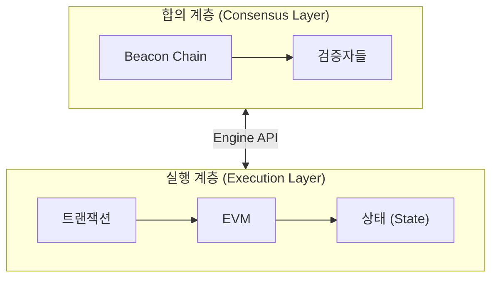
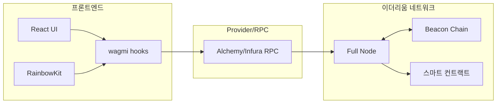

# Week 6 Quiz: Beacon Chain/Finality + Final Project Integration

> **제출 방법:** 이 파일을 복사하여 답변을 작성한 후, PR로 제출하세요.
> **평가 기준:** 개념 이해도 중심 - 6주간 배운 내용을 **통합**하여 설명하세요.

---

## 문제 1: Beacon Chain 역할 (객관식)

Beacon Chain의 **주요 역할**은 무엇인가요?

**보기:**
A) 스마트 컨트랙트를 실행하고 상태를 관리한다
B) 검증자를 관리하고 합의를 조정하며 블록 최종성을 결정한다
C) 트랜잭션 수수료를 계산하고 분배한다
D) 사용자의 지갑을 생성하고 개인키를 관리한다

**답변:**
<!--
정답 알파벳과 Beacon Chain이 "합의 계층(Consensus Layer)"으로서 하는 역할을 설명하세요.
실행 계층(Execution Layer)과의 차이도 언급하면 더 좋습니다.
-->
B)

이더리움이 PoW에서 PoS로 바뀌기 위해 추가된 Beacon Chain은 이더리움의 합의 계층(Consensus Layer)으로서 검증자 선발, Casper FFG에 따른 attestation 관리, LMD Ghost에 따른 포크 선택, checkpoint, finality를 관리한다. 반면 실행 계층(Execution Layer)은 EVM에서 트랜잭션과 스마트 컨트랙트를 실행하고 상태를 갱신하는 역할을 담당한다.

---

## 문제 2: Finality 개념 (객관식)

이더리움에서 **Finality(최종성)**가 달성되면 어떤 상태인가요?

**보기:**
A) 트랜잭션이 mempool에 들어간 상태
B) 블록이 체인에 추가되었지만 아직 재조직(reorg)될 수 있는 상태
C) 전체 검증자의 1/3 이상이 슬래싱되지 않는 한 절대 변경되지 않는 상태
D) 24시간이 지나서 트랜잭션이 만료된 상태

**답변:**
<!--
정답 알파벳과 왜 "1/3 이상 슬래싱"이 조건인지 설명하세요.
Finality가 왜 중요한지도 언급하세요.
-->
C)

이더리움에서 finality에 필요한 투표 수는 전체 stake 중 2/3 이상이므로 finalized 되지 못한 후보 체인은 최대 1/3 만큼의 투표를 받을 수 있다. 따라서 finalized checkpoint를 뒤집기 위해 공격자는 네트워크의 전체 stake 중 최소 1/3을 이미 finalized된 체인과 상충하는 후보 체인에 투표해야한다. 이 최신 투표는 구조적으로 double vote, surround vote일 수밖에 없고, 이 과정에서 Casper FFG에 의해 네트워크 전체 예치금의 1/3 이상이 슬래싱된다. 상식적으로 체인의 진행 방향 조작만으로 전체 예치금의 1/3 보다 큰 이득을 얻기는 어려우므로 finality를 위협하는 공격은 그 기대 이익을 훨씬 상회하는 경제적 비용을 요구한다.


---

## 문제 3: 왜 Finality가 중요한가 (단답형)

거래소나 dApp 개발자에게 **Finality**가 왜 중요한가요?
다음 시나리오를 예로 들어 설명하세요:

> 사용자가 거래소에 100 ETH를 입금하고, 거래소가 확인 후 내부 잔액에 반영했습니다.
> 그런데 나중에 블록 재조직(reorg)이 발생하여 입금 트랜잭션이 사라졌습니다.

**답변:**

1) 위 시나리오에서 거래소에 어떤 문제가 발생하나요?
reorg이 발생하면 컨트랙트 내부 상태가 롤백되며 사용자의 온체인 거래는 롤백되며 이전 체인 기반으로 이뤄진 사용자의 후속 온체인 거래도 함께 취소된다. 그러나 거래소 내부 오프체인 시스템에서 이미 반영된 잔액 변경이나 오프라인 출금 등의 상태는 자동으로 되돌릴 수 없다. 이로 인해 실제로는 존재하지 않는 입금이 내부 DB에 반영된 상태가 되고, 거래소가 이를 기반으로 사용자의 거래나 출금을 승인하는 경우 거래소는 직접적인 손실을 입게 된다.

2) Finality가 있으면 이 문제가 어떻게 해결되나요?
Finality가 달성되면 해당 트랜잭션이 포함된 블록은 사실상 되돌릴 수 없는 상태가 되므로 reorg으로 인해 입금 사실이 롤백될 위험이 사라진다. 따라서 거래소는 트랜잭션이 finalized된 이후에만 내부 잔액을 반영함으로써 온체인 상태와 오프체인 DB 간의 불일치를 해소하고 정합성을 보장할 수 있다.

3) 이더리움에서 Finality까지 얼마나 기다려야 하나요?
이더리움 PoS에서는 보통 약 2 epoch가 지나야 finality가 달성된다. 12초짜리 slot 32개로 구성된 1 epoch는 약 6.4분이므로 일반적으로 finality가 달성되는 데까지는 약 12~13분 정도가 소요된다.

---

## 문제 4: 포크 선택 규칙 (단답형)

이더리움은 **Casper FFG**와 **LMD-GHOST** 두 가지 메커니즘을 결합합니다.
각각의 역할은 무엇이며, **왜** 둘 다 필요한가요?

**답변:**

1) Casper FFG의 역할:
checkpoint에 justified와 finalized 상태를 부여하여 결정된 체인을 되돌릴 수 없는 상태로 확정하고 상충하는 체인이 동시에 finalized되는 것을 방지함으로써 체인의 safety를 보장한다.

2) LMD-GHOST의 역할:
검증자들의 최신 attestation을 기준으로 네트워크가 현재 체인의 head를 선택하여 따라가도록 유도함으로써 체인이 멈추지 않고 이어질 수 있는 liveness를 보장한다.

3) 왜 둘 다 필요한가 (한쪽만 있으면 어떤 문제?):
LMD-GHOST만 사용할 경우 검증자들의 최신 attestation을 기반으로 체인의 head를 빠르게 선택하여 liveness는 확보할 수 있지만 해당 체인이 되돌릴 수 없는 확정된 상태라는 보장이 없어 reorg에 취약하다. 반대로 Casper FFG만 사용할 경우 checkpoint에 대해 finality를 부여하여 safety는 확보할 수 있지만 매 순간 어떤 블록을 head로 선택해야 하는지에 대한 실시간 결정이 보장되지 않아 포크 상황에서 체인 진행이 지연될 수 있다. 따라서 이더리움은 Casper FFG와 LMD-GHOST를 모두 사용하며 체인을 빠르고 안전하게 진행시킨다.

---

## 문제 5: dApp 아키텍처 설계 (코드/아키텍처 문제)

당신은 "간단한 투표 dApp"을 만들려고 합니다.
다음 요구사항을 읽고 **컴포넌트 구조**와 **사용할 hook**들을 설계하세요.

**요구사항:**
- 사용자가 지갑을 연결할 수 있다
- 현재 투표 현황(찬성/반대 수)을 조회할 수 있다
- 사용자가 찬성 또는 반대 투표를 할 수 있다
- 투표 후 결과가 화면에 즉시 반영된다

**답변:**

```
1) 컴포넌트 구조 (어떤 컴포넌트가 필요한가):
   - App
   - WalletSection
   - VotingStatus
   - VoteActions
   - TransactionStatus

2) 각 컴포넌트에서 사용할 wagmi/RainbowKit hook:
   - 지갑 연결: RainbowKit의 ConnectButton, wagmi의 useAccount
   - 투표 현황 조회: useReadContract
   - 투표 실행: useWriteContract
   - 트랜잭션 확인: useWaitForTransactionReceipt

3) Provider 계층 구조:
   - WagmiProvider
   - QueryClientProvider
   - RainbowKitProvider
   - App(루트 컴포넌트)

```

**왜 이렇게 설계했나요:**
<!--
각 hook의 선택 이유와 데이터 흐름을 설명하세요.
-->

지갑 연결 UI는 RainbowKit가 제공하고 실제 컨트랙트 읽기/쓰기 로직은 wagmi hook이 담당하도록 설계하였다. `VotingStatus`는 조회 전용, `VoteActions`는 쓰기 전용, `TransactionStatus`는 서명/확인 상태 표시를 담당하도록 컴포넌트를 구성하였다.

데이터 흐름은 지갑 연결 -> `useReadContract`로 현재 투표 수 조회 -> `useWriteContract`로 투표 트랜잭션 전송 -> `useWaitForTransactionReceipt`로 블록 포함 확인 -> 성공 후 `refetch`로 최신 결과 재조회 순서로 진행시켜 온체인 상태와 화면 상태를 동기화한다.

---

## 문제 6: 컨트랙트-프론트엔드 연동 (빈칸 채우기)

다음 코드의 빈칸을 채워서 투표 컨트랙트와 프론트엔드를 연동하세요:

**Solidity 컨트랙트:**
```solidity
contract Voting {
    uint256 public yesVotes;
    uint256 public noVotes;

    function voteYes() external {
        yesVotes += 1;
    }

    function voteNo() external {
        noVotes += 1;
    }
}
```

**React 컴포넌트:**
```typescript
import { useReadContract, useWriteContract, _________________ } from 'wagmi';

const votingABI = [
  { name: 'yesVotes', type: 'function', stateMutability: 'view', inputs: [], outputs: [{ type: 'uint256' }] },
  { name: 'noVotes', type: 'function', stateMutability: 'view', inputs: [], outputs: [{ type: 'uint256' }] },
  { name: 'voteYes', type: 'function', stateMutability: 'nonpayable', inputs: [], outputs: [] },
  { name: 'voteNo', type: 'function', stateMutability: 'nonpayable', inputs: [], outputs: [] },
] as const;

function VotingApp() {
  // 찬성 투표 수 조회
  const { data: yesCount, refetch: refetchYes } = useReadContract({
    address: '0x1234...5678',
    abi: votingABI,
    functionName: '_________________',
  });

  // 반대 투표 수 조회
  const { data: noCount, refetch: refetchNo } = useReadContract({
    address: '0x1234...5678',
    abi: votingABI,
    functionName: '_________________',
  });

  // 투표 실행
  const { writeContract, data: hash, isPending } = useWriteContract();

  // 트랜잭션 확인 대기
  const { isLoading: isConfirming, isSuccess } = _________________({
    hash,
  });

  // 트랜잭션 성공 시 데이터 새로고침
  // TODO: isSuccess가 true가 되면 refetch를 호출해야 함

  const handleVoteYes = () => {
    writeContract({
      address: '0x1234...5678',
      abi: votingABI,
      functionName: '_________________',
    });
  };

  return (
    <div>
      <h2>현재 투표 현황</h2>
      <p>찬성: {_________________}</p>
      <p>반대: {noCount?.toString()}</p>

      <button onClick={handleVoteYes} disabled={isPending || isConfirming}>
        {isPending ? '서명 중...' : isConfirming ? '확인 중...' : '찬성 투표'}
      </button>

      {isSuccess && <p>투표 완료!</p>}
    </div>
  );
}
```

**답변:**
```typescript
// 완성된 코드를 여기에 작성하세요

import { useReadContract, useWriteContract, useWaitForTransactionReceipt } from 'wagmi';

const votingABI = [
  { name: 'yesVotes', type: 'function', stateMutability: 'view', inputs: [], outputs: [{ type: 'uint256' }] },
  { name: 'noVotes', type: 'function', stateMutability: 'view', inputs: [], outputs: [{ type: 'uint256' }] },
  { name: 'voteYes', type: 'function', stateMutability: 'nonpayable', inputs: [], outputs: [] },
  { name: 'voteNo', type: 'function', stateMutability: 'nonpayable', inputs: [], outputs: [] },
] as const;

function VotingApp() {
  // 찬성 투표 수 조회
  const { data: yesCount, refetch: refetchYes } = useReadContract({
    address: '0x1234...5678',
    abi: votingABI,
    functionName: 'yesVotes', //public 변수 yesVotes의 getter
  });

  // 반대 투표 수 조회
  const { data: noCount, refetch: refetchNo } = useReadContract({
    address: '0x1234...5678',
    abi: votingABI,
    functionName: 'noVotes', //public 변수 noVotes의 getter
  });

  // 투표 실행
  const { writeContract, data: hash, isPending } = useWriteContract();

  // 트랜잭션 확인 대기
  const { isLoading: isConfirming, isSuccess } = useWaitForTransactionReceipt({
    hash,
  });

  // 트랜잭션 성공 시 데이터 새로고침
  // TODO: isSuccess가 true가 되면 refetch를 호출해야 함

  const handleVoteYes = () => {
    writeContract({
      address: '0x1234...5678',
      abi: votingABI,
      functionName: 'voteYes',
    });
  };

  return (
    <div>
      <h2>현재 투표 현황</h2>
      <p>찬성: {yesCount?.toString()}</p>
      <p>반대: {noCount?.toString()}</p>

      <button onClick={handleVoteYes} disabled={isPending || isConfirming}>
        {isPending ? '서명 중...' : isConfirming ? '확인 중...' : '찬성 투표'}
      </button>

      {isSuccess && <p>투표 완료!</p>}
    </div>
  );
}
```

**데이터 흐름을 설명하세요:**
<!--
1) 사용자가 "찬성 투표" 버튼 클릭 -> ... -> 화면 업데이트까지의 과정을 설명하세요.
-->
사용자가 "찬성 투표" 버튼을 누르면 `writeContract`가 `voteYes` 호출 트랜잭션을 생성하고 연결된 지갑으로 서명을 요청한다. 서명이 완료되면 RPC 노드로 전달하고 `useWaitForTransactionReceipt`가 트랜잭션 해시가 담긴 RPC 노드의 응답을 기다린다. 트랜잭션이 블록에 포함되어 성공하면 `isSuccess`가 `true`가 되며 `useEffect`에서 `refetch`를 호출한다. 이 결과로 최신 온체인 상태가 화면에 반영되어 찬성 투표수가 증가하고 "투표 완료!"가 화면에 출력된다.

---

## 문제 7: 트랜잭션 흐름 디버깅 (취약점 찾기)

다음 코드에서 **문제점**을 찾고 수정하세요. 사용자가 투표를 해도 화면이 업데이트되지 않습니다.

```typescript
// BAD CODE - 왜 화면이 업데이트되지 않나요?
function BrokenVoting() {
  const { data: voteCount } = useReadContract({
    address: '0x...',
    abi: votingABI,
    functionName: 'yesVotes',
  });

  const { writeContract, data: hash } = useWriteContract();

  const { isSuccess } = useWaitForTransactionReceipt({ hash });

  const handleVote = () => {
    writeContract({
      address: '0x...',
      abi: votingABI,
      functionName: 'voteYes',
    });
  };

  // isSuccess가 true가 되어도 voteCount가 업데이트되지 않음!

  return (
    <div>
      <p>찬성: {voteCount?.toString()}</p>
      <button onClick={handleVote}>투표</button>
      {isSuccess && <p>투표 완료!</p>}
    </div>
  );
}
```

**1) 발견한 문제점:**
<!--
왜 화면이 업데이트되지 않는지 설명하세요.
-->
`useReadContract`가 트랜잭션 전송 전에 읽어온 `voteCount`를 업데이트하는 로직이 존재하지 않는다. `isSuccess`는 트랜잭션 성공 여부를 나타내므로 isSuccess에 대한 반응으로 `refetch`를 호출하도록 하면 voteCount를 자동으로 다시 읽어와 상태를 업데이트하고 화면에 반영할 수 있다.

**2) 올바른 수정 방법:**
```typescript
// GOOD CODE - 수정된 버전을 작성하세요
function FixedVoting() {
  const { data: voteCount, refetch } = useReadContract({
    address: '0x...',
    abi: votingABI,
    functionName: 'yesVotes',
  });

  const { writeContract, data: hash, isPending } = useWriteContract();

  const { isLoading: isConfirming, isSuccess } = useWaitForTransactionReceipt({
    hash,
  });

  useEffect(() => {     //isSuccess가 false -> true로 바뀌면 React가 refetch를 호출하여 useReadContract의 yesVotes로 voteCount 다시 조회 
    if (!isSuccess) return;
    refetch();
  }, [isSuccess, refetch]);  //isSuccess가 바뀌거나 refetch 함수 참조가 바뀌면 effect를 다시 수행

  const handleVote = () => {
    writeContract({
      address: '0x...',
      abi: votingABI,
      functionName: 'voteYes',
    });
  };

  return (
    <div>
      <p>찬성: {voteCount?.toString()}</p>
      <button onClick={handleVote} disabled={isPending || isConfirming}>투표</button>
      {isSuccess && <p>투표 완료!</p>}
    </div>
  );
}

```

**3) refetch가 필요한 이유:**
<!--
블록체인 데이터와 React 상태의 관계를 설명하세요.
-->
블록체인 데이터는 React 컴포넌트 내부 상태가 아니라 외부 데이터 소스이므로 트랜잭션으로 온체인 상태가 바뀌어도 프론트엔드가 다시 읽어오지 않으면 기존 React 상태는 그대로 남아있다. 변경된 온체인 상태를 `refetch`로 다시 가져와서 React 상태를 갱신해야 화면과 동기화할 수 있다.

---

## 문제 8: Beacon Chain 구조 (다이어그램 해석)

다음 다이어그램은 이더리움의 두 계층 구조를 보여줍니다:



**질문:**

1) **합의 계층(CL)**과 **실행 계층(EL)**의 역할 차이는 무엇인가요?
CL은 검증자 선발, Casper FFG에 따른 attestation 관리, Ghost LMD에 따른 포크 선택, checkpoint, finality를 담당한다. EL은 EVM에서 트랜잭션 실행, 컨트랙트 상태 갱신, 연산을 담당한다.

2) **Engine API**를 통해 두 계층이 주고받는 정보는 무엇인가요?
CL은 EL에 블록 payload 생성과 검증을 요청하고 EL은 payload 실행 결과, 유효성, 블록 관련 상태 정보를 CL에 전달한다. Engine API는 두 Layer가 합의 결과와 실행 결과를 서로 주고받을 수 있게하는 인터페이스이다.

3) 사용자가 트랜잭션을 전송하면 CL과 EL에서 각각 어떤 일이 일어나나요?
트랜잭션은 먼저 EL에 의해 네트워크로 전파되어 EL 노드의 mempool에 들어가고 EVM에서 실행되어 컨트랙트 결과와 상태 변경이 계산된다. 그 뒤 CL에서 검증자들은 어떤 블록이 체인의 head인지 attestation하고 checkpoint를 기반으로 justified/finalized 상태를 만들어 최종성을 부여한다.

---

## 문제 9: Slot/Epoch 관계 (다이어그램 해석)

다음 다이어그램은 Slot과 Epoch의 관계를 보여줍니다:

```mermaid
gantt
    title Epoch 구조 (6.4분)
    dateFormat X
    axisFormat %s

    section Epoch N
    Slot 0     :a1, 0, 12
    Slot 1     :a2, 12, 24
    Slot 2     :a3, 24, 36
    ...        :a4, 36, 372
    Slot 31    :a5, 372, 384

    section Checkpoint
    Epoch N 끝 :milestone, 384, 0
```



**질문:**

1) 1 Slot은 몇 초이고, 1 Epoch은 몇 개의 Slot으로 구성되나요?
1 slot은 12초이고, 1 epoch은 32개의 slot으로 구성된다.

2) **Checkpoint**는 언제 발생하며 어떤 역할을 하나요?
Checkpoint는 각 epoch의 끝(직전 에포크의 마지막 슬롯->다음 에포크의 첫 슬롯)에서 정의되며 검증자들은 이 checkpoint를 기준으로 투표하며 최종성을 부여한다. 이렇게 epoch 단위로 합의를 배치 처리함으로써 더 안정적이고 효율적으로 동기화를 가능하게 한다.

3) **Finality**가 달성되려면 몇 Epoch이 필요하고, 시간으로는 약 몇 분인가요?
한 checkpoint가 justified 되고 다음 epoch에서도 checkpoint가 justified되면, 이전 checkpoint가 finalized되는 방식으로 진행되므로 Finality는 보통 약 2 epoch에 걸쳐 달성된다. 1 epoch가 약 6.4분이므로 약 12.8분이 필요하다.


---

## 문제 10: dApp 전체 아키텍처 (다이어그램 해석)

다음 다이어그램은 dApp의 전체 아키텍처를 보여줍니다:



**질문:**

1) 사용자가 **"투표하기" 버튼**을 클릭하면, UI에서 스마트 컨트랙트까지 데이터가 어떤 경로로 전달되나요?
사용자의 클릭 이벤트는 React UI에서 `wagmi`의 `useWriteContract`로 전달되어 트랜잭션 요청을 생성한다. 이 요청은 RainbowKit으로 연결된 지갑에서 서명된 뒤 RPC Provider로 전송되고 RPC는 이더리움 노드에 전달한다. 이 노드는 해당 트랜잭션을 EVM에서 실행함으로써 스마트 컨트랙트의 상태를 변경시키고 이러한 상태는 BC2의 합의에 의해 체인에 반영된다. 

2) **RPC Provider**(Alchemy/Infura)의 역할은 무엇인가요? 없다면 어떤 문제가 생기나요?
RPC Provider는 프론트엔드가 직접 이더리움 노드를 운영하지 않고도 체인 데이터를 조회하고 트랜잭션을 전송할 수 있게 해주는 중계 인터페이스이다. RPC Provider가 없으면 dApp은 블록 조회, 컨트랙트 읽기, 트랜잭션 브로드캐스트를 수행하기 위해 직접 노드를 운영하며 네트워크에 참여해야한다.

3) 6주간 배운 내용을 종합하여, 트랜잭션이 **전송 -> 실행 -> 블록 포함 -> Finality**까지 거치는 전체 흐름을 설명하세요.

1. dApp이 writeContract를 실행하여 연결된 지갑에 트랜잭션 전송 요청을 보낸다.
2. 지갑이 호출할 컨트랙트 주소, 함수 데이터(calldata), gas, nonce 등 트랜잭션 필드를 구성(unsigned tx 생성)
3. 사용자가 지갑에서 트랜잭션 서명을 승인
4. 트랜잭션에 서명 정보가 채워짐(signed tx 생성)
5. 지갑이 signed tx를 RPC 노드에 전달(eth_sendRawTransaction 호출)
6. RPC 노드는 수신한 signed tx의 keccak256 해시를 계산 후 tx hash를 응답으로 반환
7. RPC 노드는 해당 트랜잭션을 자신의 mempool에 추가하고 네트워크를 통해 다른 EL 노드에 전파 (트랜잭션은 각 노드의 mempool로 전파되며 validator가 블록에 포함시키기를 대기)
8. block proposer는 EL에서 mempool의 트랜잭션을 선택하여 execution payload에 담고, EVM 실행한 결과를 블록에 포함
9. CL의 validator들이 블록과 에포크를 검증하고 attestation 수행
10. CL의 합의로 트랜잭션이 포함된 블록이 속한 체크포인트가 justifed되고, 다음 에포크의 체크포인트가 justified되면서 자동으로 finality 획득 

---

## 제출 전 체크리스트

- [x] 모든 문제에 답변을 작성했는가?
- [x] 객관식 문제: 정답 선택 **이유**를 설명했는가?
- [x] 단답형 문제: 2-3문장 이상으로 충분히 설명했는가?
- [x] 코드 문제: 완성된 코드와 **왜 그렇게 작성했는지** 설명했는가?
- [x] 다이어그램 문제: 6주간 배운 내용을 **연결**지어 설명했는가?

---

## 6주 과정 축하합니다!

이 퀴즈를 완료하면 6주 이더리움 온보딩 이론 과정이 마무리됩니다.

**배운 것들:**
- Week 1: State, Account, EOA vs CA
- Week 2: Transaction, Signature, Security (Private Key)
- Week 3: EVM, Gas, Security (Reentrancy, CEI)
- Week 4: Block, Network, MPT, Security (Eclipse, 51%)
- Week 5: PoS, Validator, Consensus, RainbowKit
- Week 6: Beacon Chain, Finality, Full-stack Integration

**다음 단계:** 나만의 dApp 프로젝트를 시작하세요!
